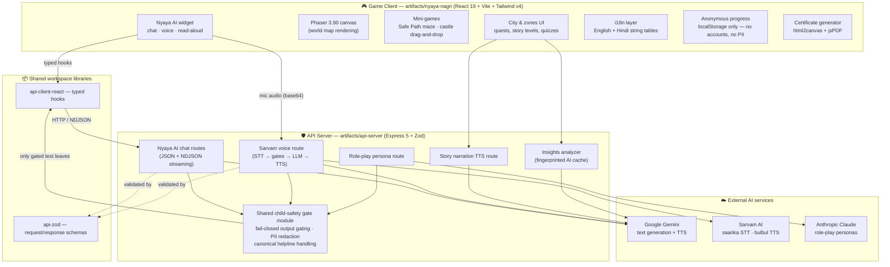
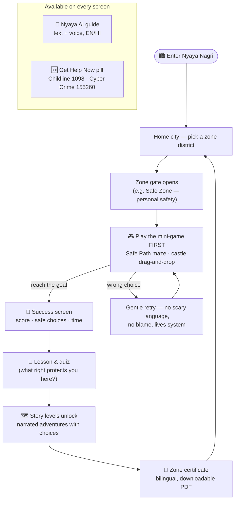
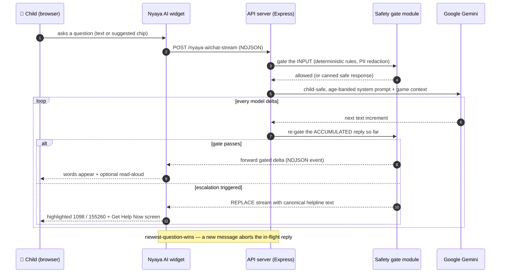
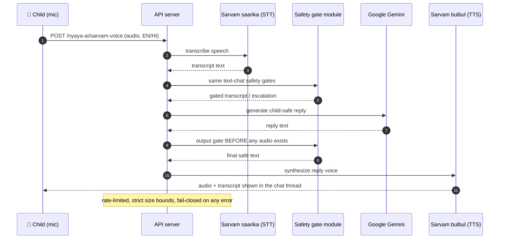

<div align="center">

# ⚖️ Nyaya Nagri — न्याय नगरी

### *Know Your Rights. Build Your Future.*

**A gamified legal-literacy city where children (8–18) learn their rights under Indian law — by playing.**

Built for **Smart India Hackathon — Problem Statement SIH1281** (Gamified Platform for Child Rights Awareness).


</div>

---

## 📚 Table of Contents

- [What is Nyaya Nagri?](#-what-is-nyaya-nagri)
- [Feature Tour](#-feature-tour)
- [System Architecture](#-system-architecture)
- [How the Game Works (Player Workflow)](#-how-the-game-works-player-workflow)
- [API Architecture](#-api-architecture)
  - [Streaming AI chat — safety-gated at every step](#streaming-ai-chat--safety-gated-at-every-step)
  - [Voice conversation pipeline](#voice-conversation-pipeline)
  - [API routes](#api-routes)
- [Child Safety & Privacy by Design](#-child-safety--privacy-by-design)
- [The Legal Content Backbone](#-the-legal-content-backbone)
- [Tech Stack](#-tech-stack)
- [Monorepo Structure](#-monorepo-structure)
- [Getting Started](#-getting-started)
- [Quality & Testing](#-quality--testing)
- [Roadmap](#-roadmap)
- [Disclaimer](#-disclaimer)

---

## 🏙 What is Nyaya Nagri?

Most children in India don't know that the law already protects them — at school, at home, online, and at work. **Nyaya Nagri** ("Justice City") turns that missing knowledge into an explorable cartoon city: every district teaches one area of child rights through **mini-games, story levels, and quizzes**, with a friendly **AI rights guide** available at every step in **English and Hindi**.

The design promise, in one line:

> **Play first, learn by doing, and always know who to call in real life** — Childline **1098** and Cyber Crime Helpline **155260** are one tap away on every single screen.

It is an **awareness and confidence-building tool** — it never replaces real reporting systems; it *teaches* them and deep-links to them.

---

## ✨ Feature Tour

### 🗺 A city of rights — 7 themed zones
Each zone is a district of the city with its own building, guardian character, games and story levels — including **Safe Zone** (personal safety / POCSO), **Right to Childhood** (child labour), **School Rights** (right to education), **Digital Safety** (online safety & cyberbullying), **Family & Community Shield** (child marriage, who-can-help directory), and the central **Know Your Rights** palace.

### 🎮 Game-first learning (never lecture-first)
- **Safe Path Adventure** — a maze game about spotting warning signs and reaching the Safe Zone: walk the path, answer safety questions at decision points, earn stars.
- **Right to Childhood** — a drag-and-drop castle game about recognizing child labour situations.
- **Story levels** — illustrated, narrated adventures with choices; correct legal facts are **hard-coded and never AI-generated**.
- **Quizzes with a game-board look** — score, streaks and recap; a lesson only counts once the game is actually played (the "game-first gate").
- **Certificates** — printable bilingual completion certificates rendered fully client-side (html2canvas + jsPDF), including proper Devanagari text.

### 🤖 Nyaya AI — one assistant, everywhere
- **Streaming text chat** powered by Google Gemini: replies appear word-by-word, and **every increment passes a server-side safety gate before the child sees it**.
- **Turn-based voice conversations**: speak in Hindi or English — Sarvam **saarika** transcribes, the same text-safety gates run, Gemini answers, Sarvam **bulbul** speaks the reply back.
- **Story narration voice** with Gemini TTS, plus sentence-by-sentence read-aloud of chat replies.
- **Role-play personas** (judge / police / teacher-style guides) through a dedicated, equally-gated endpoint powered by **Anthropic Claude** — always labelled as role-play, never pretending to be a real person.

### 🛡 Always-visible help
A **Get Help Now** pill floats above *every* screen — game, story, quiz, chat — showing **Childline 1098** and **Cyber Crime 155260**. Escalation-worthy AI replies are replaced by canonical helpline text, never paraphrased.

### 🌐 Fully bilingual, accessibility-aware
Complete English + हिंदी content (not machine-translated at runtime — reviewed string tables), `prefers-reduced-motion` support, touch and keyboard controls, kid-friendly typography.

### 📊 Learning insights
An evidence-gated insights view summarizes real play sessions (locally PIN-gated for guardians/teachers); AI summaries are cached and fingerprinted so identical evidence never re-queries the model.

---

## 🏗 System Architecture

The project is a **pnpm monorepo** with two runtime artifacts — a game client and an API server — plus shared typed libraries. The client never talks to AI providers directly; **every AI call goes through the API server's safety pipeline**.



**Key architectural decisions**

| Decision | Why |
|---|---|
| All AI traffic proxied through the API server | API keys never reach the browser; every reply passes deterministic child-safety gates before display |
| One shared safety module for *all* AI routes | Chat, streaming chat, voice and personas can never drift apart in what they allow |
| Progress stored anonymously in the browser | DPDP-style data minimization — the platform needs zero personal data to work |
| Legal facts, quiz answers and helpline text are hard-coded content files | AI may *narrate*, but it can never rewrite the law or a helpline number |
| Monorepo with typed shared schemas (Zod) | The client and server can't disagree about API shapes — it's one type system end to end |

---

## 🕹 How the Game Works (Player Workflow)

The learning loop is deliberately **game-first**: a child must *play* the zone's mini-game before the lesson is credited — reading a summary is never enough.



A few deliberate design rules baked into that loop:

- **Attempt-based stats** — the completion screen reports the *run you actually played*, encouraging retries instead of shaming mistakes.
- **Trauma-sensitive copy** — no scary, blaming or graphic language anywhere; danger is shown through implication ("warning signs"), per the 8–11 age band rules.
- **Celebrations are transient, unlocks are persistent** — confetti today, progress forever (in the browser's local store).

---

## 🔌 API Architecture

### Streaming AI chat — safety-gated at every step

The signature pipeline of the project: the child sees words as the model produces them, **but no token is ever forwarded before the *accumulated* reply re-passes the safety gate**. If a reply turns unsafe midway, the stream is replaced wholesale with canonical, hard-coded helpline guidance.



### Voice conversation pipeline

Voice is **turn-based by design** (not an open live channel): every spoken turn becomes text, and that text walks through the *exact same* gates as typed chat before any audio is synthesized.



### API routes

| Method | Route | Purpose |
|---|---|---|
| `GET` | `/healthz` | Liveness check |
| `POST` | `/nyaya-ai/chat` | Classic JSON chat (automatic fallback transport) |
| `POST` | `/nyaya-ai/chat-stream` | NDJSON streaming chat — the primary low-latency path |
| `POST` | `/nyaya-ai/sarvam-voice` | One full voice turn: STT → gates → LLM → TTS |
| `POST` | `/nyaya-ai/voice-guard` | Deterministic transcript gate used by voice flows |
| `POST` | `/nyaya-ai/voice-token` | Short-lived, constraint-locked token for the Gemini Live transport (alternate voice path) |
| `POST` | `/persona/chat` | Labelled role-play personas (judge / police / teacher), same gates |
| `POST` | `/insights/analyze` | Evidence-gated learning-insights summarizer (cached + fingerprinted) |
| `GET` | `/story-adventure-voice/tts` | Story narration audio (Gemini TTS) |

The core chat, persona and insights contracts are validated with **Zod schemas shared between client and server** (`lib/api-zod`) and consumed through typed React hooks (`lib/api-client-react`); the voice and story-TTS routes use strict route-local validation instead (size bounds, rate limits, manifest checks).

---

## 🛡 Child Safety & Privacy by Design

Safety is not a feature here — it is the architecture. The concrete guarantees:

1. **Educational tool, not a crisis service.** A hard-coded disclaimer ("educational legal information, not professional legal advice") is permanently visible in the AI panel, and every escalation redirects to real authorities.
2. **Fail-closed AI gating.** If a safety check cannot run, the reply does not go out. Streaming replies are re-gated on the *accumulated* text before every forwarded increment.
3. **Helpline numbers are sacred.** 1098 / 155260 appear only from hard-coded, canonical strings — the AI corpus itself contains no helpline digits, so the model can never mangle them.
4. **PII redaction with child-context nuance.** Long digit runs (8+) are redacted from AI traffic — deliberately sparing short legal references and helpline numbers.
5. **No accounts, no PII, no server-side profiles.** Progress is pseudonymous and lives in the browser (DPDP-style data minimization). Chat history is session-memory only — never persisted.
6. **The AI never rewrites the law.** Legal facts, quiz correctness, choice outcomes and safety text are locked, reviewable content files; models only narrate around them.
7. **No dark patterns.** No real-money mechanics, no pay-to-win, no streak-guilt loops.
8. **Trauma-sensitive narrative.** Sensitive topics are shown through implication and safe narrative distance — never graphic depiction.
9. **The assistant is always a computer helper.** It introduces itself as one; role-play personas are visibly labelled role-play.

---

## ⚖️ The Legal Content Backbone

Every quest, scenario and AI answer traces back to real Indian legal instruments (the project's authoritative content matrix):

| Instrument | What children learn | In-game home |
|---|---|---|
| **Constitution of India** — Art. 14/15(3), 21, 21A, 23, 24, 39(e)(f) | Equality, life & liberty, free education (6–14), no trafficking/forced labour, no hazardous child labour | Woven through every zone |
| **POCSO Act, 2012** (+ Rules 2020) | Safe/unsafe touch, warning signs, consent, reporting, child-friendly courts | **Safe Zone** — Safe Path Adventure |
| **Juvenile Justice Act, 2015** (am. 2021) | CWC/JJB/SJPU — what happens when a child meets the system, rights-protective lens | Justice-system content & stories |
| **RTE Act, 2009** | Free & compulsory education 6–14, 25% EWS quota, no expulsion till elementary | **School Rights** zone |
| **Child Labour (P&R) Act, 1986/2016** | Spotting child labour, adolescent hazardous-work protections | **Right to Childhood** castle game |
| **Prohibition of Child Marriage Act, 2006** | Marriage age law, annulment, where to get help | **Family & Community Shield** |
| **IT Act, 2000** + IT Rules 2021 | Cyberbullying, grooming red flags, reporting via 155260 | **Digital Safety** zone |
| **DPDP Act, 2023** | Governs *the platform itself* — consent & data minimization | The app's own privacy design |

Supporting institutions taught in-game: **CHILDLINE 1098**, POCSO e-Box (NCPCR), CWC, JJB, SJPU, DCPU, NCPCR/SCPCRs, Cyber Crime portal — always as *real places to go*, never simulated inside the app.

---

## 🧰 Tech Stack

| Layer | Technology |
|---|---|
| UI framework | **React 19** + **TypeScript** (strict), **Vite 7** |
| Styling | **Tailwind CSS v4**, custom kid-friendly design tokens, CSS keyframe art |
| Game canvas | **Phaser 3.90** (world map), DOM/CSS mini-games, **framer-motion** drag-and-drop |
| AI — text | **Google Gemini** (chat, streaming NDJSON) + **Anthropic Claude** (role-play personas) — always behind the server-side proxy |
| AI — voice | **Sarvam AI** (saarika STT, bulbul TTS) + Gemini TTS for story narration |
| API server | **Express 5**, **Zod** validation, **pino** structured logging |
| Shared contracts | pnpm workspace libs: `api-zod` (schemas) → `api-client-react` (typed hooks) |
| Certificates | html2canvas + jsPDF (client-side, Devanagari-safe) |
| Persistence | Browser localStorage (anonymous progress), session-only chat memory |
| Tooling | pnpm monorepo, TypeScript project references, tsx smoke suites |

---

## 📁 Monorepo Structure

```
workspace/
├── artifacts/
│   ├── nyaya-nagri/          # 🎮 The game client (React + Vite)
│   │   ├── src/
│   │   │   ├── home/         # City home screen
│   │   │   ├── world/        # Zones, world map, HUD
│   │   │   ├── games/        # Mini-games (safepath/, childhood/, …)
│   │   │   ├── story/        # Story levels, narration voice
│   │   │   ├── avatar/       # Nyaya AI widget (chat + voice)
│   │   │   ├── i18n/         # English + Hindi string tables
│   │   │   ├── data/         # progressStore, settingsStore
│   │   │   └── insights/     # Learning insights (PIN-gated)
│   │   └── scripts/          # 13 smoke-test suites (~1k checks)
│   ├── api-server/           # 🛡 Express API (AI proxy + safety gates)
│   │   └── src/routes/       # nyayaai/, persona/, insights/, storyvoice/
│   └── nyaya-nagri-ds/       # 🎨 Design system (tokens, docs)
├── lib/
│   ├── api-zod/              # Shared Zod schemas (single source of truth)
│   └── api-client-react/     # Generated typed hooks for the client
```

---

## 🚀 Getting Started

**Prerequisites:** tested with Node.js 20+ and pnpm 9.

```bash
# 1. Install everything (workspace-aware)
pnpm install

# 2. Start the API server (terminal 1)
pnpm --filter @workspace/api-server run dev

# 3. Start the game client (terminal 2)
pnpm --filter @workspace/nyaya-nagri run dev
```

**Environment variables** — core gameplay runs fully without any AI keys; the API server's AI endpoints need their provider credentials:

| Variable | Used for |
|---|---|
| `GEMINI_API_KEY` | Nyaya AI chat, story narration TTS, insights summaries |
| `SARVAM_API_KEY` | Voice conversations (STT + TTS) |
| `AI_INTEGRATIONS_ANTHROPIC_API_KEY` | Role-play personas (Anthropic Claude) |
| `AI_INTEGRATIONS_ANTHROPIC_BASE_URL` | Anthropic-compatible endpoint used by the persona route |

> On Replit, the project runs out of the box with its configured workflows — one per artifact.

---

## ✅ Quality & Testing

- **13 smoke-test suites** (`artifacts/nyaya-nagri/scripts/*.smoke.ts`) with **~1,000 assertions** guarding: maze-grid invariants (goal always reachable, a decision always forced), deterministic full-game walkthroughs with exact score expectations, bilingual content parity (EN ≠ HI, Devanagari present), **zero helpline digits inside AI-reachable corpora**, wiring seams (game-first gates, single write-site for lesson credit), and asset integrity.
- **Strict TypeScript** across the workspace with project references.
- **Dev seams** for fast manual review (`/?zone=zone1`, `&spphase=success`, `&watched=…`) — every screen is reachable without replaying the whole game.

```bash
cd artifacts/nyaya-nagri
npx tsx scripts/safepath.smoke.ts     # one suite
for f in scripts/*.smoke.ts; do npx tsx "$f"; done   # all suites
```

---

## 🗺 Roadmap

- [ ] Remaining zones' level-flow rollout (zone-by-zone, following the approved reference zone)
- [ ] Gujarati as a third language (stretch goal from the original spec)
- [ ] Teacher cohorts & assignment views (aggregate-only, no child PII)
- [ ] More mini-game types for the variety pack
- [ ] Accessibility deep-pass (screen-reader labels for every interactive element)

---

## ⚠️ Disclaimer

Nyaya Nagri provides **educational legal information, not professional legal advice**, and is **not a crisis-response service**. If a child is in danger or needs help right now:

> **📞 CHILDLINE — 1098** (24/7, free) &nbsp;•&nbsp; **💻 Cyber Crime Helpline — 155260** / [cybercrime.gov.in](https://cybercrime.gov.in)

---

<div align="center">

**Made with ❤️ for every child's right to know their rights.**

*Smart India Hackathon — SIH1281*

</div>
